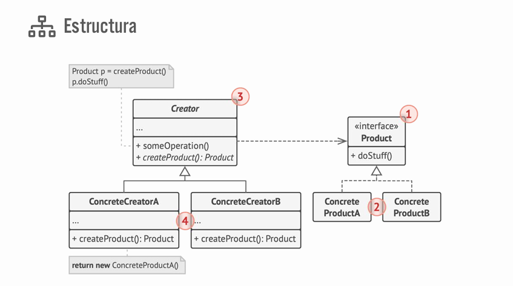

# Factory Method

Factory Method es un patron de diseno creacional que proporciona una interfaz para crear objetos en una superclase, mientras permite 
a las subclases alterar el tipo de objetos que se crearon.

1. El Producto declara la interfaz, que es común a todos los objetos que puede producir la clase creadora y sus subclases.
2. Los productos concretos son distintas implementaciones de la interfaz producto.
3. La clase Creadora declara el método fábrica que devuelve nuevos objetos de producto. Es importante que el tipo de retorno de este método coincida con la interfaz de producto.
4. Los Creadores Concretos sobrescriben el Factory Method base, de modo que devuelva un tipo diferente de producto.

Observa que el método fábrica no tiene que crear nuevas instancias todo el tiempo. También puede devolver objetos existentes de una memoria caché, una agrupación de objetos, u otra fuente.

## Que contiene:

Siempre debemos de tener una clase abstracta que sirva como factory general, es decir, a partir de esa clase se crean los objetos que quiero obtener, será la clase creadora (Creator) y tiene que tener una interfaz que sea el producto. Se debe de crear un método que retorne la interfaz que implementarán Concret Product.

```csharp
// Creator
public abstract class SaleFactory
{
    public abstract ISale GetSale();
}

// Product
public interface ISale
{
    public void Sell(decimal total);
}
```

---

Con la interfaz definimos lo que hará la regla de negocio, como ventas normal que es StoreSale y implementa la interfaz ISale que tiene el método para la lógica de negocio.

```csharp
// Concret Product
public class StoreSale : ISale
{
    private decimal _extra;

    public StoreSale(decimal extra)
    {
        _extra = extra;
    }
    public void Sell(decimal total)
    {
        Console.WriteLine($"La venta en tienda tiene un total {total + _extra}");
    }
}
```

---

Ahora se debe de crear una clase que sea la encargada de ser la fábrica de objetos para esa clase que viene siendo StoreSale, de esta forma no tendrás que crear instancias.

```csharp
// Concrete Creator
public class StoreSaleFactory : SaleFactory
{
    private decimal _extra;

    public StoreSaleFactory(decimal extra)
    {
        _extra = extra;
    }

    public override ISale GetSale()
    {
        return new StoreSale(_extra);
    }
}
```

### Ejemplo en consola:

```csharp
SaleFactory storeSaleFactory = new StoreSaleFactory(10);

ISale sale1 = storeSaleFactory.GetSale();
sale1.Sell(15);
```

### Ejemplo en ASP:

```csharp
// Product
public interface IEarn
{
    public decimal Earn(decimal amount);
}

// Creator
public abstract class EarnFactory
{
    public abstract IEarn GetEarn();
}

// Concret Product
public class LocalEarn : IEarn
{
    private decimal _percentage;

    public LocalEarn(decimal percentage)
    {
        _percentage = percentage;
    }

    public decimal Earn(decimal amount)
    {
        return amount * _percentage;
    }
}

// Concret Creator
public class LocalEarnFactory : EarnFactory
{
    private decimal _percentage;

    public LocalEarnFactory(decimal percentage)
    {
        _percentage = percentage;
    }

    public override IEarn GetEarn()
    {
        return new LocalEarn(_percentage);
    }
}
```

## Configuraciones:
```C# 
builder.Services.AddTransient((factory =>
{
    return new LocalEarnFactory(0.20m);
}));

public class ProductDetailsController : ControllerBase
{
    private EarnFactory _LocaEarnFactory;

    public ProductDetailsController(EarnFactory locaEarnFactory)
    {
        _LocaEarnFactory = locaEarnFactory;
    }

    public IActionResult actionResult()
    {
        var localEarn = _LocaEarnFactory.GetEarn();
        return Ok(localEarn);
    }

}
```